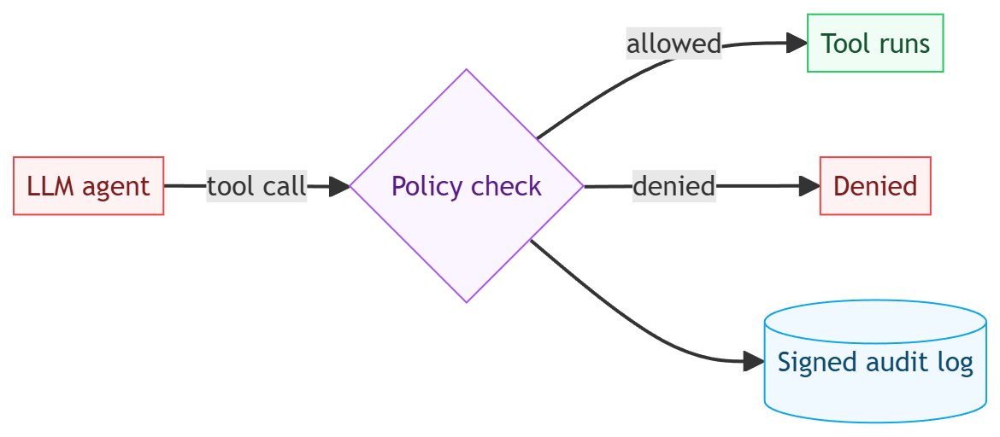

# agent-guard: design, trade-offs, and non-goals

Status: accepted
Author: Parag Sawant

Why agent-guard is built the way it is, and - just as important for a security tool -
what it deliberately does *not* try to do. An agent that can call tools is an agent
that can do damage; the job here is to make "what is this agent allowed to do" an
explicit, auditable decision instead of an implicit one.

## Problem and goals

Give an LLM agent a set of tools (read files, hit HTTP endpoints, run shell) and it
will, sooner or later, try to do something you didn't intend - read a secret, call an
external host, delete the wrong thing. agent-guard sits between the agent and every
tool call and answers three things: is this tool allowed, is this specific call
within its constraints, and is there a tamper-evident record of the decision. Goals:

1. **Deny-by-default authorization.** Nothing runs unless a policy explicitly allows
   it, and even then only within its declared constraints.
2. **Least privilege that's easy to express** - allow a tool but scope it to specific
   paths or domains, and gate high-risk actions behind human approval.
3. **A tamper-evident audit trail** - every decision is hash-chained and Ed25519
   signed, so after the fact you can prove exactly what was permitted and why.

*(The same diagram renders inline as Mermaid in the [README](README.md#how-it-works); this PNG is a static export.)*

## The security decisions, stated as decisions

**Deny-by-default is the floor, and it extends to missing arguments.** An unknown
tool is denied - that part is obvious. The subtler and more important rule: if a tool
is *constrained* to certain paths or domains but a call arrives without that argument,
the guard denies it. The reasoning is that authorization is a positive proof
obligation - the caller must show the action is in bounds. A call with no path can't
be proven in-bounds against a path allow-list, so "I couldn't check it" resolves to
"no," never to "allow." This closes the gap where an under-specified call slips
through the constraint it was supposed to respect.

**Deny patterns win over allow patterns.** When a path matches both an allow glob and
a deny glob, deny wins. Secrets and blocked paths should be un-reachable even if a
broad allow rule would otherwise cover them, so precedence goes to the restriction.

**High-risk tools return APPROVE, never a silent ALLOW.** Deleting, running shell -
these don't get a yes/no from the policy alone; they surface a human-approval decision.
The guard's contract is that a dangerous action is never authorized purely by
automated rule.

**The audit log is hash-chained and signed, per entry.** Each entry commits to the
previous entry's hash and is individually signed, so editing a past decision,
reordering entries, truncating the tail, or forging a signature with the wrong key all
break verification. The adversarial suite asserts each of these by actively tampering.

## Trade-offs I made on purpose

- **Glob-based path matching, not path normalization.** Constraints are expressed as
  globs against the path string as given. This is simple and predictable, but it means
  the *policy author* is responsible for writing deny globs that catch what they mean
  (block `*secrets*`, not just `*/secrets/*`, if you want the directory itself). I
  chose transparency - the rule does exactly what the glob says - over a normalization
  layer that would add its own surprising edge cases. A path-canonicalization option
  is a reasonable future addition, noted as such.
- **In-memory audit log.** The reference `AuditLog` keeps entries in memory. The
  chaining and signing are the point; durable storage (append to disk, ship to a WORM
  bucket) is an integration detail left to the caller.
- **Ed25519, single signer.** One key signs the trail. Detecting that the *key holder*
  rewrote history needs an external witness - out of scope, same as any single-signer
  log.

## Non-goals

- **Not a sandbox or a syscall filter.** agent-guard decides *whether* a tool call is
  authorized; it does not contain the tool's execution. Pair it with real OS-level
  isolation for defense in depth - it's the policy layer, not the jail.
- **Not tamper-proof against a compromised signer.** The audit trail is
  tamper-*evident* for published entries, not a defense against whoever holds the key.
- **Not a secrets manager or a network firewall.** It expresses which paths/domains a
  tool may touch; enforcing that at the OS or network layer is a separate control.

## Verification

There's no throughput benchmark here - correctness, not speed, is the property that
matters for an authorization layer. Instead, `tests/test_adversarial_fuzz.py` takes
the attacker's seat: thousands of randomized paths that try to escape the allow-root,
glob and argument-shape tricks, deny/allow precedence cases, and byte-level tampering
of the signed audit chain. The invariant it pins down is absolute - nothing outside
the explicit allow-list is ever authorized, and any edit to the audit log is detected.
