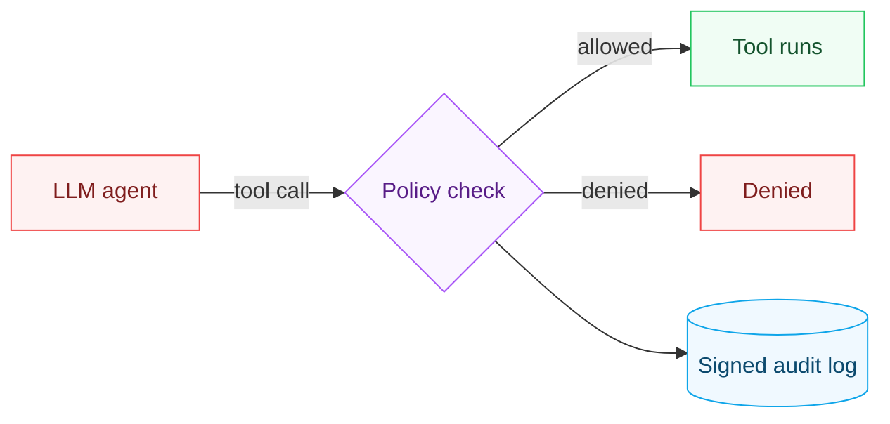

# AgentGuard


**A zero-trust runtime for AI agents.**

Tool-calling agents are a security nightmare - one prompt injection and the agent deletes data or exfiltrates secrets. AgentGuard wraps every tool call in a **deny-by-default, least-privilege policy engine**, routes high-risk actions through **human approval**, and writes a **signed, tamper-evident audit log**.

## Why it matters

Agents are only as safe as the tools they can call. AgentGuard gives you a reusable guardrail layer so a malicious prompt can't turn your agent into a data-exfil or `rm -rf` machine.

## How it works



## Quickstart

```python
from agentguard.policy import Policy, ToolCall
from agentguard.runtime import AgentGuard

policy = Policy.from_dict({
    "tools": [
        {"tool": "read_file", "allow": True, "path_allow": ["/data/*"], "path_deny": ["*.env"]},
        {"tool": "run_shell", "allow": True, "require_approval": True},
    ]
})

guard = AgentGuard(policy, approval_callback=lambda call, reason: input(f"Approve {call.tool}? [y/N] ") == "y")

# Executes only if policy allows; audited either way.
guard.guard(ToolCall("read_file", {"path": "/data/report.txt"}), execute=my_read_tool)
```

## Features

- **Deny-by-default**: tools not on the allow-list are blocked.
- **Least privilege**: path globs, domain allow-lists, per-tool constraints.
- **Human-in-the-loop**: high-risk tools (`run_shell`, etc.) require approval.
- **Signed audit log**: Ed25519-signed, hash-chained, `verify_chain()` proves integrity.

See `tests/test_agentguard.py` for the malicious-injection block demo.

## Six languages, one behavior

The policy engine, the runtime mediator, and the Ed25519-signed hash-chained audit
log — including the adversarial fuzz suite that flips bytes in the signed chain — in
each language. Each uses its platform's Ed25519: Python's `cryptography`, the JDK's
built-in provider, BouncyCastle on .NET, Go's `crypto/ed25519`, `ed25519-dalek` in
Rust, and Node's `node:crypto`.

| Language | Tests | Run |
|----------|:-----:|-----|
| Python | 21 | `pytest -q` |
| Go | 29 | `cd go && go test ./...` |
| Rust | 29 | `cd rust && cargo test` |
| C# (.NET 10) | 21 | `cd csharp && dotnet test` |
| Java (17+) | 21 | `cd java && mvn test` |
| TypeScript | 21 | `cd ts && npm test` |

One detail worth knowing when reading the fuzz suite: `entries()` returns a copy of
the entry list, so a genuine reorder test has to swap entries in the backing store
rather than in the returned array. Every port's reorder test is white-box for that
reason, and each asserts `verifyChain()` goes false — because each entry's previous
hash pins its position in the chain.

## Layout

```
agent-guard/
├── agentguard/            the policy engine + runtime + audit log (Python)
│   ├── runtime.py         AgentGuard.guard() — mediates every tool call
│   ├── policy/            deny-by-default policy engine (allow-lists, path/domain globs)
│   └── audit.py           Ed25519-signed, hash-chained audit log + verify_chain()
├── csharp/                the same engine + audit log, ported to .NET 10 (xUnit + BouncyCastle)
├── java/                  the same, in Java 17+ (JUnit / Maven, built-in Ed25519)
├── go/                    the same, in Go (crypto/ed25519)
├── rust/                  the same, in Rust (ed25519-dalek)
├── ts/                    the same, in TypeScript (vitest, node:crypto)
├── examples_policy.yaml   a sample least-privilege policy
├── tests/                 incl. the malicious-injection block demo
└── DESIGN.md              the threat model, why guardrails live in the runtime, the non-goals
```

## Design notes

- **[DESIGN.md](DESIGN.md)** - the security decisions stated as decisions (deny-by-default
  extends to missing constrained arguments, deny-beats-allow precedence, approve-never-
  silent-allow for high-risk tools), the threat model (tamper-*evident*, not tamper-
  proof against the key holder), and the non-goals (it's the policy layer, not a
  sandbox).
- **Adversarial fuzz** (`tests/test_adversarial_fuzz.py`) - takes the attacker's seat:
  thousands of randomized paths trying to escape the allow-root, glob/argument-shape
  tricks, deny/allow precedence, and byte-level tampering of the signed audit chain.
  Nothing outside the allow-list is ever authorized; any edit to the log is detected.

## Part of [parag-labs](https://github.com/parag-labs)

Small, focused tools for building AI systems you can trust.

LedgerRAG · EvalForge · **AgentGuard** · PromptShield · DeployKit

## License

MIT
